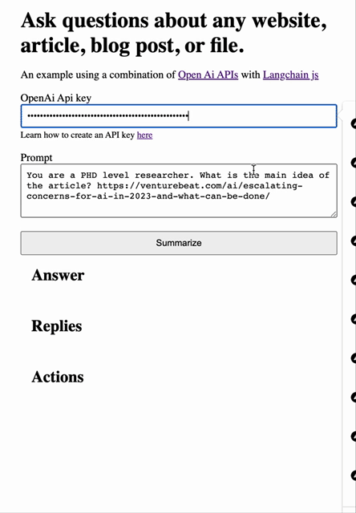

# Url summarizor

*Use GPT to quickly digest documents*

Experiment summarize document by url project to practice interacting with Ai agents.



# Features

Visit `/` to:
- Enter an OpenAI api key
- Enter a prompt optionally with a url to a doc and recieve a Ai generated summary
- Action steps logged


Visit `/app` to summarize docs from a notion database:
*Visit https://developers.notion.com/docs/create-a-notion-integration for full details*

- Enter notion secret and database id and hit submit
- Peruse list of notion docs
- Generate a summary from the notion doc URL property
- Edit the returned summary but updating the notion doc with summary

# Steps to run the project

## Pull project

```
git clone ...
```

## Install dependencies

```
// install pnpm if you haven't yet
npm i pnpm

pnpm install
```

## Run the project

```
// development
npm run dev

// production build
npm run build && npm run start
```

## Get an OpenAi API key

https://platform.openai.com/account/api-keys

## Start digesting content

To summarize any content from a url simply enter any of the following prompts:

`Summarize the content of this article https://www.wired.com/story/rethinking-relationship-artificial-intelligence/`

`Explain at a PDF level what the article is about https://www.economist.com/finance-and-economics/2023/05/07/your-job-is-probably-safe-from-artificial-intelligence`
